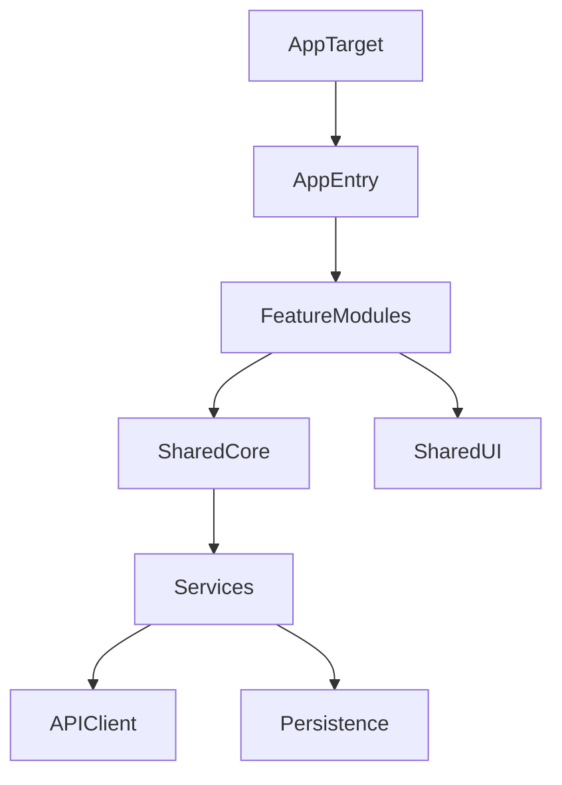
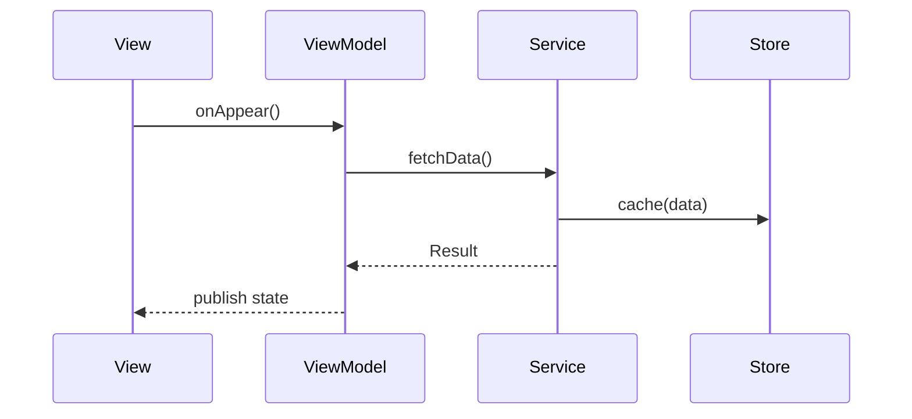

# Architecture Documentation

> **Note**: This document provides implementation patterns for Apple-native apps. For a high-level overview, see [ARCHITECTURE.md](../ARCHITECTURE.md).

## System Overview

This architecture targets SwiftUI apps across macOS, iOS, iPadOS, and tvOS with shared Swift Package modules, MVVM, and Swift Concurrency.

## App Structure

### Recommended Modules

- **AppTarget**: App entry point and platform-specific configuration
- **SharedCore**: Domain models, networking, storage
- **SharedUI**: Design system and reusable SwiftUI components
- **FeatureModules**: Feature-specific views, view models, and routes

## MVVM + Coordinator (Navigation)

### MVVM Pattern

- **View**: SwiftUI view rendering state
- **ViewModel**: `Observable` / `ObservableObject` for state and actions
- **Model**: Domain types and services

### Navigation

Use `NavigationStack` with explicit routing:

- A `Router` owns navigation state
- Views receive routes and actions
- Keep navigation logic out of views

## Concurrency Model

### Core Rules

- Use `async/await` and `Task` for async work
- Isolate shared mutable state with `actor`
- Annotate UI updates with `@MainActor`
- Avoid blocking the main thread

### Example Flow

## Data Management

### Persistence

Preferred:

- **SwiftData** for modern data models
- **Core Data** for advanced use cases

Rules:

- Access persistence through repository interfaces
- Keep `ModelContext` use isolated to data layer
- Avoid direct access from views

### Networking

- Use `URLSession` with typed requests/responses
- Centralize request building and error handling
- Validate and decode on background threads

## Dependency Injection

- Use protocol-driven interfaces
- Inject services into view models
- Use a `DependencyContainer` per feature or app

## Error Handling

- Use typed error enums
- Surface user-facing errors in view models
- Log non-fatal errors using unified logging (`os.Logger`)

## Accessibility

- VoiceOver friendly labels and hints
- Dynamic Type and content size category support
- Focus management for tvOS

## Testing Strategy

- **Unit**: View models, services, pure functions
- **Integration**: Repository and API client
- **UI**: XCUITest for critical flows
- **Snapshot** (optional): `swift-snapshot-testing`
