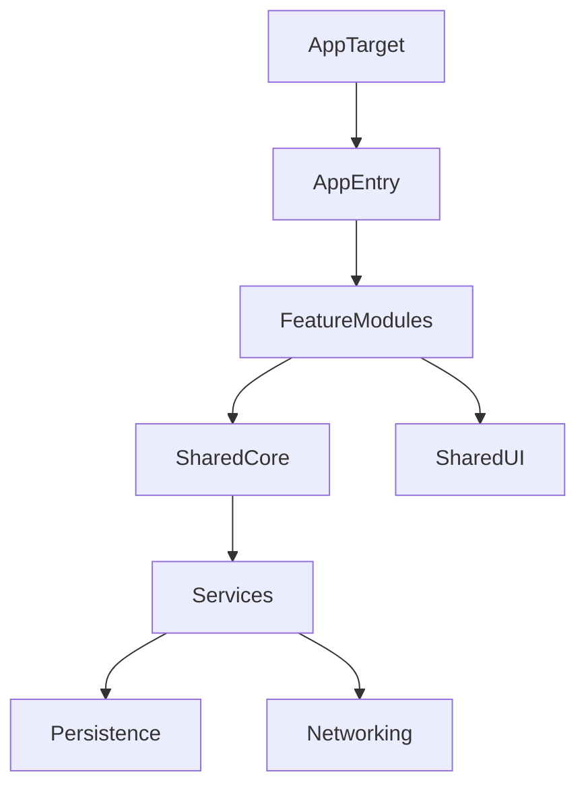

# Architecture Documentation

> **Note**: This document provides a high-level overview. For detailed implementation patterns, see [.context/architecture.md](.context/architecture.md).

## Overview

This configuration targets Apple-native apps built with SwiftUI, Swift Concurrency, and shared Swift packages across macOS, iOS, iPadOS, and tvOS.

## High-Level Architecture

## Core Principles

- Modular features with shared packages
- MVVM for state and UI separation
- Swift Concurrency with actors for isolation
- Accessibility and HIG compliance
- Strict typing and explicit dependencies

## Data Flow

- Views render state from view models
- View models call services and repositories
- Services perform IO and map results to domain models

## Testing

- Unit tests for view models and services
- Integration tests for data layers
- UI tests for critical user journeys

## Release

- TestFlight for distribution
- App Store Connect for release management
